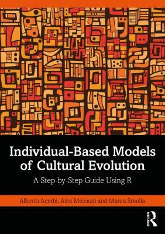

# Individual-based models of cultural evolution

## A step-by-step guide using R

This repository contains the code to generate, using [bookdown](https://bookdown.org), the book:

*Individual-based models of cultural evolution. A step-by-step guide using R*

by 

Alberto Acerbi, Alex Mesoudi, and Marco Smolla

The published version on the book is hosted at [https://acerbialberto.com/IBM-cultevo/](https://acerbialberto.com/IBM-cultevo/), and a physical copy is published by Routledge. You can purchase it [here](https://www.routledge.com/Individual-Based-Models-of-Cultural-Evolution-A-Step-by-Step-Guide-Using/Acerbi-Mesoudi-Smolla/p/book/9781032252063), and in all the usual places.

If you would like to cite the book, you can use this reference:

Acerbi Alberto, Mesoudi Alex, and Smolla Marco (2022) *Individual-based models of cultural evolution. A step-by-step guide using R*. London, Routledge.

--

# Table of content

Introduction

*Basics*

* Unbiased transmission

* Unbiased and biased mutation

* Biased transmission: direct bias

* Biased transmission: frequency-dependent indirect bias

* Biased transmission: demonstrator-based indirect bias

* Vertical and horizontal transmission

* Multiple traits models

*Advanced topics - The evolution of cultural evolution*

* Rogers’ Paradox

* Rogers’ Paradox: A Solution

*Advanced topics - Cultural inheritance*

* Reproduction and transformation

* Social learning of social learning rules

* Traits inter-dependence

*Advanced topics - Culture and populations*

* Demography

* Social network structure

* Group structured populations and migration

References

